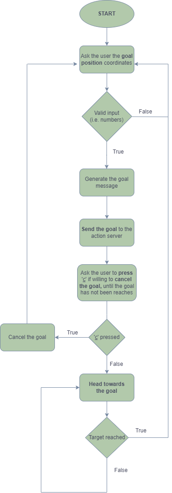

Assignment 2 - Research Trach 1
================================

This program is a simple 3D simulation of a robot in an planar environment, with some obstacles inside, using ROS (Robot Operating System).   
The goal of this project was to implement an action client for the given action server, which implements the *bug0* algorithm, a service node returning the last target position, and a last node implementing a server retrieving the distance from the current target and the average robot speed.

Installing and running
----------------------

The simulator requires the ROS installation, following the instructions at this link: https://wiki.ros.org/noetic/Installation/Ubuntu, and the terminal emulator *xterm*, running the following command on the shell: 
```
sudo apt-get -y install xterm
```
 in order to get a dedicated terminal for every printing node.  
At this point, clone the repository by typing 
```
git clone https://github.com/ambraierardi/assignment2_rt1
```  
Now, simply run the following line: 
```
roslaunch assignment_2_2023 assignment1.launch
```
on the downloaded folder and follow the instructions on the shell.


### ROS ###
ROS (Robot Operating System), is an open-source meta-operating framework designed for robotics, which provides services and tools to help developers build and manage complex robot software.
### Gazebo ###
Gazebo is a 3D robotics simulator widely used to simulate the behavior of robots in a virtual environment before deploying them in the real world.  
For more information about the Gazebo package installation, visit the following link: https://classic.gazebosim.org/tutorials?tut=ros_installing&cat=connect_ros.

Custom message
----------------------
To publish the position coordinates and the velocity parameters, it was created a custom message, in the file `Custom.msg`, which is in the folder *msg*. In particular, this message has the following parameters:  
* `x`: the x spatial coordinate;
* `y`: the y spatial coordinate;
* `v_x`: the linear velocity along the x direction;
* `v_z`: the angular velocity along the z direction.

Last target service
----------------------
To return the last target position, it was created a service, in the file `Last_target.srv`, which is in the folder *srv*. In particular, this service has not request parameters, and the following response parameters:
* `x`: the x spatial coordinate of the last goal;
* `y`: the y spatial coordinate of the last target.

Distance and average velocity service
----------------------
To retrieve the distance of the robot from the current target and its average linear velocity along x and angular velocity along z, it was created a service, in the file `Dist_ave_vel.srv`, which is in the folder *srv*. In particular, this service has not request parameters, and the following response parameters:
* `d`: the distance from the target;
* `ave_v_x`: the average linear velocity along the x direction;
* `ave_v_z`: the average angular velocity along the z direction.

Nodes
----------------------
For the `node_a.py` and the `node_c.py`, a dedicated terminal will be opened at the launch of the assignment1.launch file, in order to visualize there only the printed stuff of the node, separated by the gazebo informations.
### Action Client ###
The first implemented node was `node_a.py`, carrying out an *action client* to ask the user to give in input the coordinates of the desired position, which is where the robot should go.  
In this node, first the publisher is created, in order to publish the message of type *Custom* on a new topic called `/pos_and_vel`, exploiting the information of position and velocity published on the topic `/odom`, obtained by the subscriber, defined right after the publisher, in the main function.  
After the user put a valid goal position, which means a pair of numbers, the goal is sent to the action server, and the robot starts moving.  
At this point, the user is free to cancel the goal at any time, before the desired position is reached, by entering 'c' on the shell.  
In any case, whether the goal has been cancelled or has been reached correctly, the user can enter a new input.  
To stop the program, the user should press 'ctrl + c' on the shell.
### Last Target Service Node ###
The second implemented node is `node_b.py`, executing a service node to get the coordinates of the last target.  
First, a service is created, with the name `last_target`, of type *Last_target*, whose callback function fethces the interested parameters, which are `'des_pos_x'` and `'des_pos_y'`, with the ROS command `get_param`, since in the first node they are filled with the goal throught `set_command`.  
In order to get the last target coordinates, it's necessary to call the service with the following line 
```
rosservice call /last_target
```
 in another tab.
### Distance and average velocity service node ###
In the last node, `node_c.py`, it was created a subscriber to the topic published by the first node, `/pos_and_vel`, in order to get the current position and velocity of the robot, and to compute the distance from the target, the average linear velocity along x and angular velocity about the z axis.  
After the subscriber, a service is created, named `dist_ave_vel`, of type *Dist_ave_vel*, whose callback function computes the distance from the target, as an euclidean distance between the target itself and the last registred goal, the average linear velocity, as the sum of the stored linear velocities in a list of length equal to the parameter `'window_size'`, introduced in the launch file, over the window size, and finally the average angular velocity, computed in the same way as the linear one, using the previously stored last angular velocities.  
When the service is called, with the command 
```
rosservice call /pos_vel_srv
```
 in another tab, these three parameters are printed on the shell.


Flowchart of the project
----------------------


Rosgraph of the processes
----------------------

