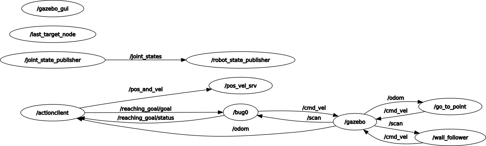

Assignment 2 - Research Trach 1
================================

This program is a simple 3D simulation of a robot in an planar environment, with some obstacles inside, using ROS (Robot Operating System).   
The goal of this project was to implement an action client for the given action server, which implements the *bug0* algorithm, a service node returning the last target position, and a last node implementing a server retrieving the distance from the current target and the average robot speed.

Installing and running
----------------------

The simulator requires the ROS installation, following the instructions at this link: https://wiki.ros.org/noetic/Installation/Ubuntu, and the terminal emulator *xterm*, running the following command on the shell: `sudo apt-get -y install xterm`, in order to get a dedicated terminal for every printing node.  
At this point, clone the repository by typing `git clone https://github.com/ambraierardi/assignment2_rt1`.  
Now, simply run the following line: `roslaunch assignment_2_2023 assignment1.launch`on the downloaded folder and follow the instructions on the shell.

### ROS ###

ROS (Robot Operating System), is an open-source meta-operating framework designed for robotics, which provides services and tools to help developers build and manage complex robot software.

Custom message
----------------------
To publish the position coordinates and the velocity parameters, it was created a custom message, in the file `Custom.msg`, which is in the folder *msg*. In particular, this message has the following parameters:  
* `x`: the x spatial coordinate;
* `y`: the y spatial coordinate;
* `v_x`: the linear velocity along the x direction;
* `v_z`: the angular velocity along the z direction.

Last target service
----------------------
To return the last target position, it was created a service, in the file `Last_target.srv`, which is in the folder *srv*. In particular, this service has not request parameters, and the following response parameters:
* `x`: the x spatial coordinate of the last goal;
* `y`: the y spatial coordinate of the last target.

Distance and average velocity service
----------------------
To retrieve the distance of the robot from the current target and its average linear velocity along x and angular velocity along z, it was created a service, in the file `Dist_ave_vel.srv`, which is in the folder *srv*. In particular, this service has not request parameters, and the following response parameters:
* `d`: the distance from the target;
* `ave_v_x`: the average linear velocity along the x direction;
* `ave_v_z`: the average angular velocity along the z direction.

Nodes
----------------------
The first implemented node was `node_a.py`, performing an *action client* to ask the user to give in input the coordinated of the desired position, where the robot should go.  
In this node, first the a publisher is created, in order to publish the Custom message, 

Flowchart of the project
----------------------

Rosgraph of the processes
----------------------

